# 🛡️ SafeZone - Parental Control Android Application

[](https://opensource.org/licenses/MIT)
[](https://www.android.com/)
[](https://android-arsenal.com/api?level=24)

SafeZone is a comprehensive native Android parental control application that helps parents monitor and manage their children's smartphone usage in real-time. Built with Firebase backend, it provides instant app blocking, website filtering, screen time management, location tracking, and real-time alerts.

## 📥 Download APK

**Ready to test SafeZone?** Download the latest APK and install it on your Android device:

👉 **[Download SafeZone.apk](https://github.com/Ijlal-Hussaini/Safe-Zone-Kid-Friendly-Internet-and-App-Monitoring/raw/main/releases/SafeZone.apk)**

For installation instructions, see the [releases folder](releases/).

## 📱 Screenshots

<table>
  <tr>
    <td>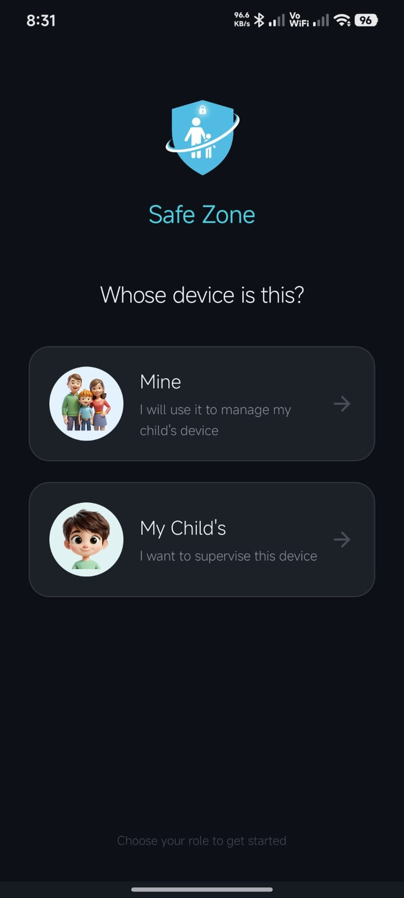</td>
    <td>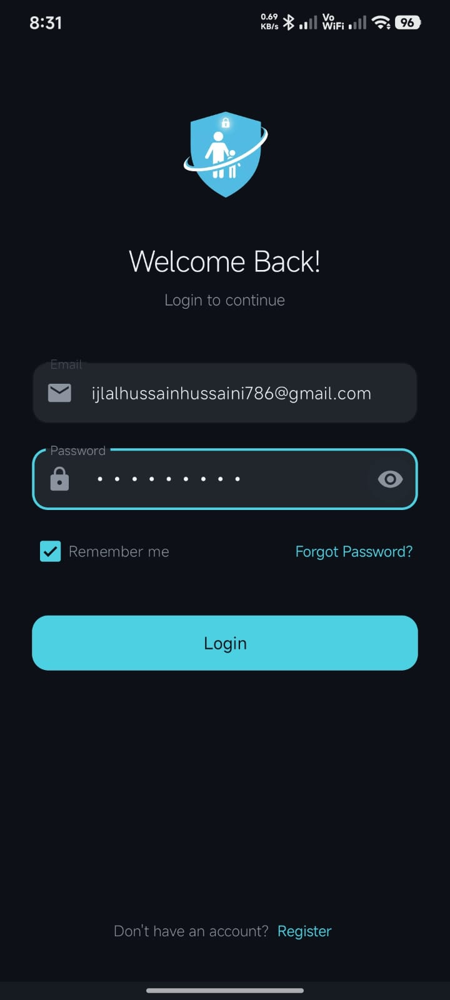</td>
    <td>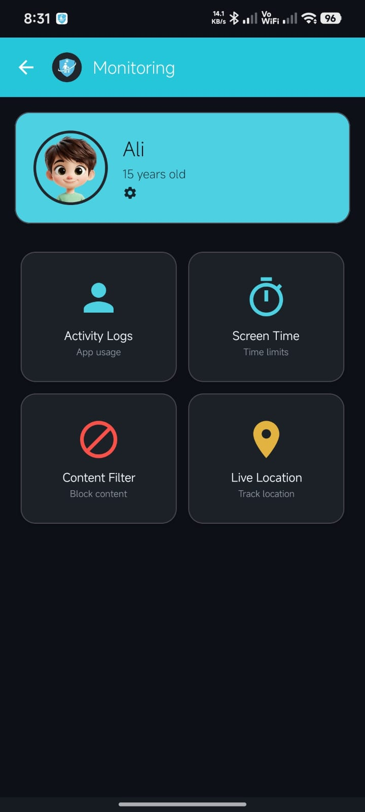</td>
    <td>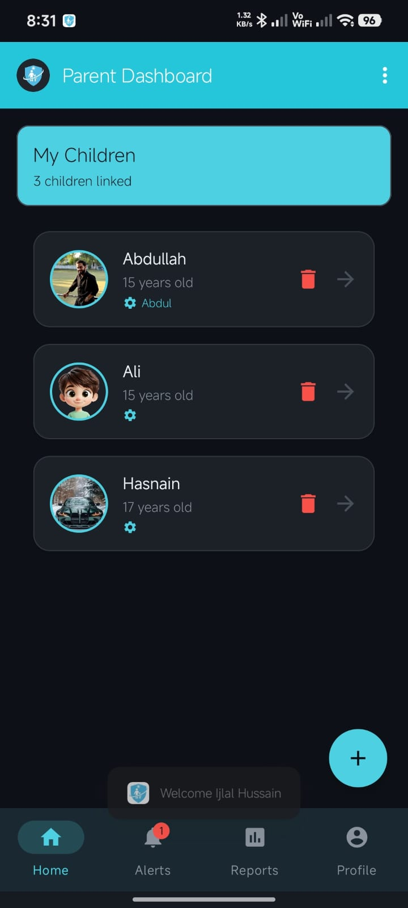</td>
  </tr>
  <tr>
    <td align="center"><b>Role Selection</b></td>
    <td align="center"><b>Login Screen</b></td>
    <td align="center"><b>Child Monitoring</b></td>
    <td align="center"><b>Parent Dashboard</b></td>
  </tr>
  <tr>
    <td>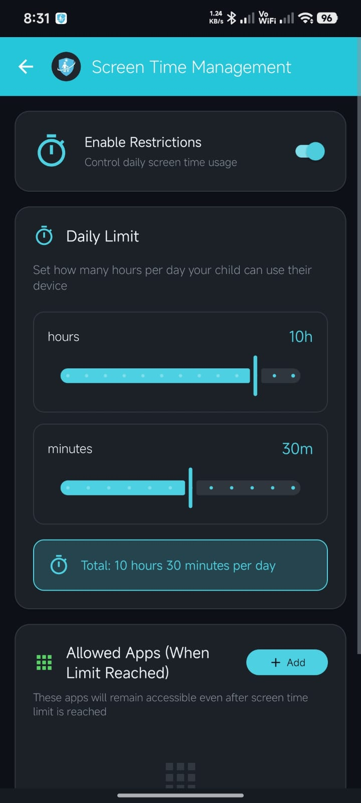</td>
    <td>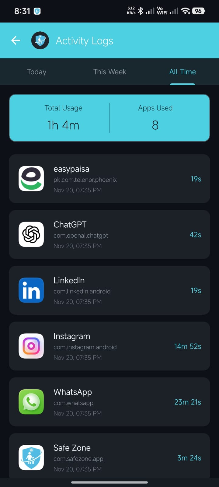</td>
    <td>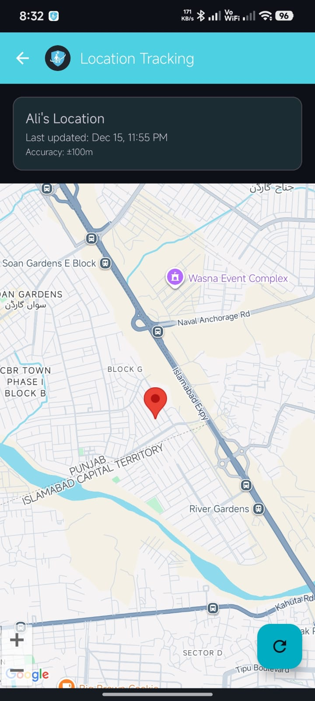</td>
    <td>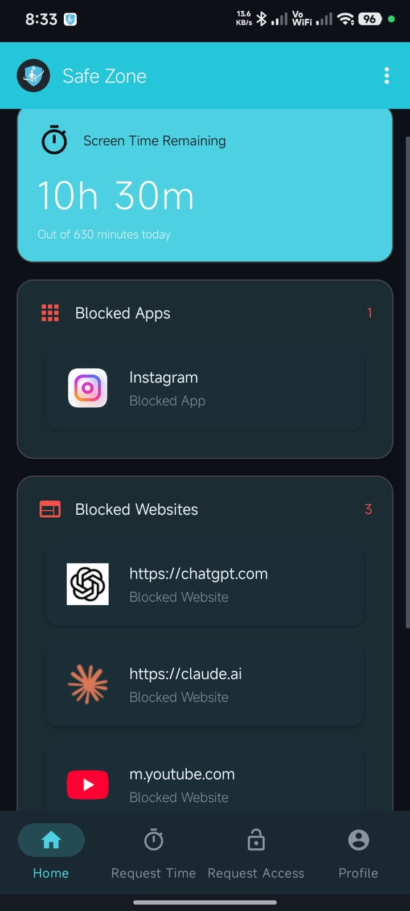</td>
  </tr>
  <tr>
    <td align="center"><b>Screen Time Settings</b></td>
    <td align="center"><b>Activity Logs</b></td>
    <td align="center"><b>Location Tracking</b></td>
    <td align="center"><b>Child Dashboard</b></td>
  </tr>
  <tr>
    <td>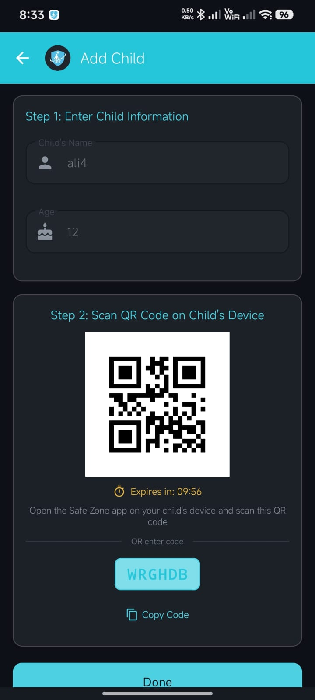</td>
    <td>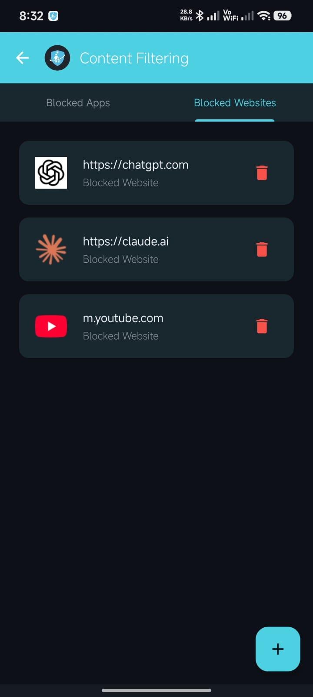</td>
    <td>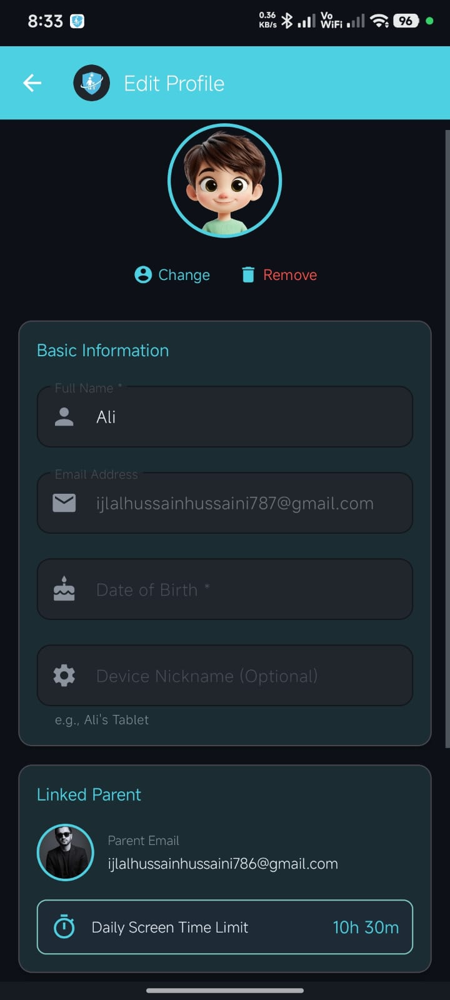</td>
    <td>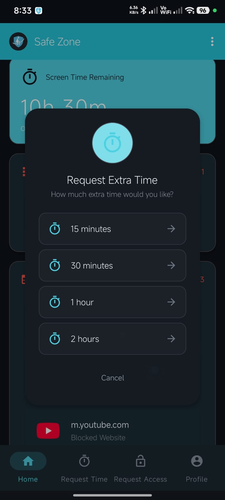</td>
  </tr>
  <tr>
    <td align="center"><b>Device Linking</b></td>
    <td align="center"><b>Content Filtering</b></td>
    <td align="center"><b>Edit Profile</b></td>
    <td align="center"><b>Requeest Extra Time</b></td>
  </tr>
</table>

## ✨ Key Features

### 👨‍👩‍👧‍👦 For Parents
- **Real-time Monitoring** - Track children's app usage and activity logs
- **App Blocking** - Instantly block inappropriate apps with dual-layer enforcement
- **Website Filtering** - Block harmful websites across all major browsers
- **Screen Time Management** - Set daily usage limits with customizable allowed apps
- **Location Tracking** - View child's real-time location on Google Maps
- **Instant Alerts** - Receive push notifications for blocked attempts and limit violations
- **Multiple Children** - Manage multiple children from a single parent account
- **Activity Reports** - View detailed usage analytics and reports

### 👶 For Children
- **Safe Browsing** - Automatic blocking of inappropriate content
- **Time Management** - Learn healthy device usage habits
- **Request Access** - Request additional screen time from parents
- **Emergency Access** - Always-allowed apps (Phone, Contacts, Emergency)

## 🏗️ Architecture & Technology Stack

### Platform
- **Language**: Java
- **Minimum SDK**: API 24 (Android 7.0)
- **Target SDK**: API 34 (Android 14)
- **Architecture**: MVVM-like with Repository Pattern

### Backend & Services
- **Firebase Realtime Database** - Real-time data synchronization
- **Firebase Authentication** - Secure user authentication with email verification
- **Firebase Storage** - Profile photo storage
- **Google Maps SDK** - Location tracking and visualization
- **ZXing Library** - QR code generation and scanning

### Key Android Components
- Foreground Services for continuous monitoring
- Accessibility Service for instant app/website blocking
- UsageStatsManager for app usage tracking
- FusedLocationProviderClient for battery-efficient location
- Device Admin API for uninstall prevention

## 🚀 Getting Started

### Prerequisites
- Android Studio Arctic Fox or later
- Android device/emulator running Android 7.0 (API 24) or higher
- Firebase account
- Google Maps API key

### Installation

1. **Clone the repository**
   ```bash
   git clone https://github.com/Ijlal-Hussaini/Safe-Zone-Kid-Friendly-Internet-and-App-Monitoring.git
   cd Safe-Zone-Kid-Friendly-Internet-and-App-Monitoring
   ```

2. **Set up Firebase**
   - Create a new Firebase project at [Firebase Console](https://console.firebase.google.com/)
   - Add an Android app to your Firebase project
   - Download `google-services.json`
   - Place it in the `app/` directory

3. **Configure Firebase Authentication**
   - Enable Email/Password authentication in Firebase Console
   - Configure email verification settings

4. **Set up Firebase Realtime Database**
   - Create a Realtime Database in your Firebase project
   - Set up security rules (see [Security Rules](#security-rules) section)

5. **Add Google Maps API Key**
   - Get an API key from [Google Cloud Console](https://console.cloud.google.com/)
   - Add it to `AndroidManifest.xml`:
     ```xml
     <meta-data
         android:name="com.google.android.geo.API_KEY"
         android:value="YOUR_API_KEY_HERE" />
     ```

6. **Build and Run**
   ```bash
   ./gradlew assembleDebug
   ```
   Or use Android Studio's Run button

## 📖 How It Works

### Parent-Child Linking
1. Parent creates account and generates QR code
2. Child creates account and scans parent's QR code
3. Bidirectional link established in Firebase
4. Parent can now monitor and control child's device

### App Blocking (Dual-Layer Architecture)
- **Layer 1**: Accessibility Service detects app launch instantly
- **Layer 2**: Background polling (50ms intervals) as backup
- Blocked apps are closed before they fully open
- Parent receives instant alert notification

### Screen Time Enforcement
- Tracks actual device usage time (not wall clock)
- Resets when parent enables/changes limit
- Warning notification at 5 minutes remaining
- Device locks when limit exceeded
- Allowed apps remain accessible

### Website Blocking
- Monitors browser URL bars via Accessibility Service
- Supports Chrome, Firefox, Opera, Brave, Edge, Samsung Browser
- Domain matching with subdomain support
- Instant blocking with back navigation

## 🔐 Security & Privacy

### Security Features
- ✅ Email verification required for all accounts
- ✅ Role-based access control (Parent/Child)
- ✅ Password strength validation
- ✅ Device Admin prevents unauthorized uninstallation
- ✅ QR codes expire in 10 minutes
- ✅ Firebase Security Rules protect data access

### Security Rules
```json
{
  "rules": {
    "users": {
      "$uid": {
        ".read": "$uid === auth.uid || (parent-child relationship exists)",
        ".write": "$uid === auth.uid",
        "screenTimeRules": {
          ".write": "(parent can write to child's rules)"
        }
      }
    }
  }
}
```

### Privacy Considerations
- All data stored securely in Firebase
- Location data only accessible to linked parent
- No third-party data sharing
- Parents can only access their linked children's data

## 📋 Required Permissions

### Child Device Permissions
| Permission | Purpose |
|------------|---------|
| `PACKAGE_USAGE_STATS` | Monitor app usage statistics |
| `BIND_ACCESSIBILITY_SERVICE` | Instant app/website blocking |
| `SYSTEM_ALERT_WINDOW` | Display blocking dialogs |
| `BIND_DEVICE_ADMIN` | Prevent app uninstallation |
| `ACCESS_FINE_LOCATION` | Track device location |
| `ACCESS_BACKGROUND_LOCATION` | Location updates in background |
| `FOREGROUND_SERVICE` | Keep monitoring services running |
| `RECEIVE_BOOT_COMPLETED` | Auto-start after device restart |

## 🗂️ Project Structure

```
app/src/main/java/com/safezone/app/
├── activities/          # UI Activities
│   ├── LoginActivity.java
│   ├── ParentDashboardActivity.java
│   ├── ChildDashboardActivity.java
│   └── ...
├── adapters/           # RecyclerView Adapters
├── fragments/          # Reusable UI Fragments
├── models/             # Data Models
│   ├── User.java
│   ├── Alert.java
│   └── ...
├── services/           # Background Services
│   ├── ActivityMonitorService.java
│   ├── AppBlockingService.java
│   ├── LocationTrackingService.java
│   └── ...
├── receivers/          # Broadcast Receivers
├── utils/              # Helper Classes
│   ├── FirebaseHelper.java
│   ├── NotificationHelper.java
│   └── ...
└── SafeZoneApplication.java
```

## 🧪 Testing

The app has been tested on:
- Multiple Android versions (7.0 to 14)
- Various manufacturers (Samsung, Xiaomi, OnePlus, Google Pixel)
- Different screen sizes and resolutions
- Edge cases (device restart, network loss, battery optimization)

## 🐛 Known Limitations

- **Android Only**: iOS version not available
- **Browser Dependency**: Website blocking requires supported browsers
- **Battery Impact**: Multiple foreground services consume battery
- **Manufacturer Variations**: Some devices (Xiaomi, Huawei) aggressively kill background services
- **Root Access**: Rooted devices may bypass restrictions

## 🔮 Future Enhancements

- [ ] Geofencing with safe zone alerts
- [ ] Call and SMS monitoring
- [ ] Social media content analysis
- [ ] AI-powered inappropriate content detection
- [ ] iOS version
- [ ] Web dashboard for parents
- [ ] Multi-parent support
- [ ] Weekly/monthly usage reports

## 🤝 Contributing

Contributions are welcome! Please follow these steps:

1. Fork the repository
2. Create a feature branch (`git checkout -b feature/AmazingFeature`)
3. Commit your changes (`git commit -m 'Add some AmazingFeature'`)
4. Push to the branch (`git push origin feature/AmazingFeature`)
5. Open a Pull Request

## 📄 License

This project is licensed under the MIT License - see the [LICENSE](LICENSE) file for details.

## 👨‍💻 Author

**Ijlal Hussain**
- GitHub: [@Ijlal-Hussaini](https://github.com/Ijlal-Hussaini)
- Email: ijlalhussainhussaini786@gmail.com

## 🙏 Acknowledgments

- Firebase for backend infrastructure
- ZXing for QR code functionality
- Google Maps for location services
- Android Open Source Project

## 📞 Support

If you encounter any issues or have questions:
- Open an issue on GitHub
- Email: ijlalhussainhussaini786@gmail.com

## ⚠️ Disclaimer

This application is designed for parental monitoring purposes only. Users must comply with local laws and regulations regarding privacy and monitoring. The developers are not responsible for misuse of this application.

---

**Note**: This is a Final Year Project (FYP) developed as part of academic requirements. For detailed technical documentation, see [FYP Defense Document](docs/FYP_DEFENSE_DOCUMENT.md).
