# 🛡️ SafeZone — Parental Control & Digital Safety Android Application

<div align="center">
  
  
  
  
  
  
</div>

<br/>

> **SafeZone** is an enterprise-grade, dual-mode native Android parental control system engineered to curate a safe digital environment for children. Developed as a **Final Year Project (FYP) at the National University of Modern Languages (NUML)**, the application operates via two synchronized interfaces: a comprehensive **Parent Management Hub** and a protected **Child Companion Monitor** running persistent background oversight.

---

## 📥 Direct APK Download & Quick Installation

Ready to test SafeZone on your Android phone?

👉 **[Download SafeZone.apk (v1.0 Production Package)](https://github.com/Ijlal-Hussaini/Safe-Zone-Kid-Friendly-Internet-and-App-Monitoring/raw/main/releases/SafeZone.apk)**  

### 🚀 Quick Install Instructions:
1. Download `SafeZone.apk` on your Android device (Android 7.0+ / API 24+).
2. Open the downloaded file and tap **Install** (Enable *"Install unknown apps"* if prompted).
3. Open SafeZone, select your role (**Parent** or **Child**), and follow the on-screen pairing wizard.

---

## 📱 Application Screenshots & UI Sequence (1 to 15)

<table>
  <tr>
    <td align="center" width="20%">
      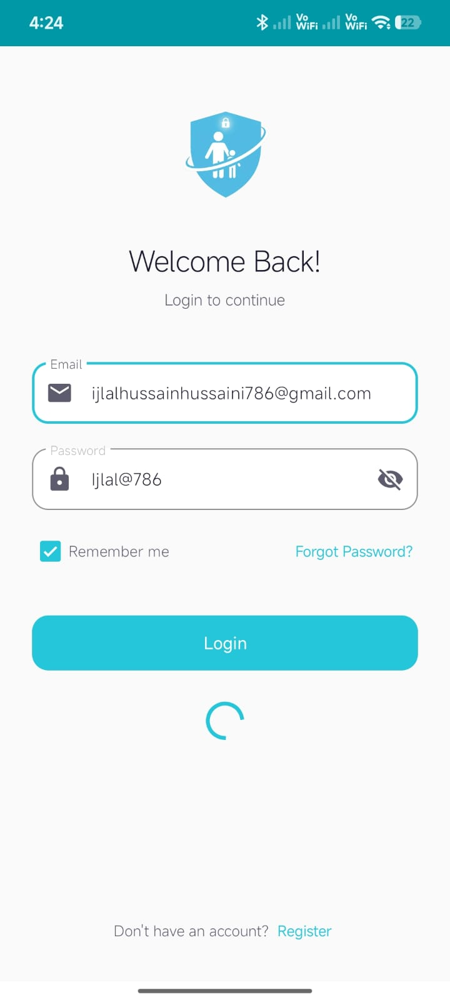
      <br/><b>1. Authentication</b>
    </td>
    <td align="center" width="20%">
      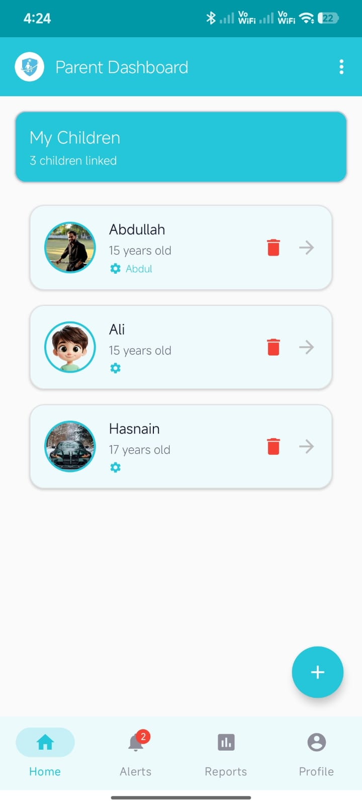
      <br/><b>2. Parent Hub</b>
    </td>
    <td align="center" width="20%">
      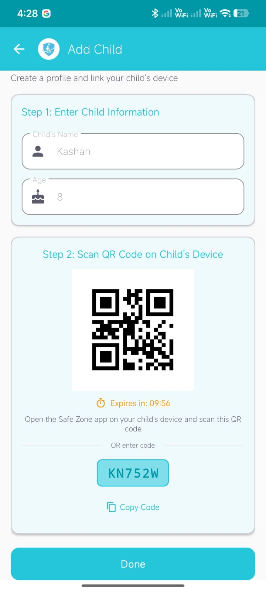
      <br/><b>3. Device Pairing</b>
    </td>
    <td align="center" width="20%">
      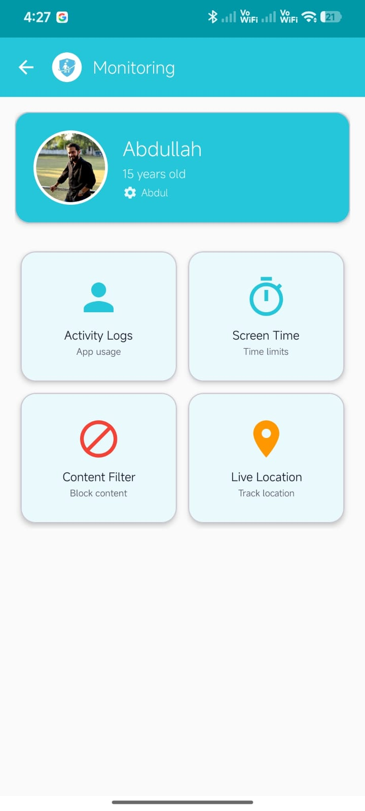
      <br/><b>4. Real-Time Monitor</b>
    </td>
    <td align="center" width="20%">
      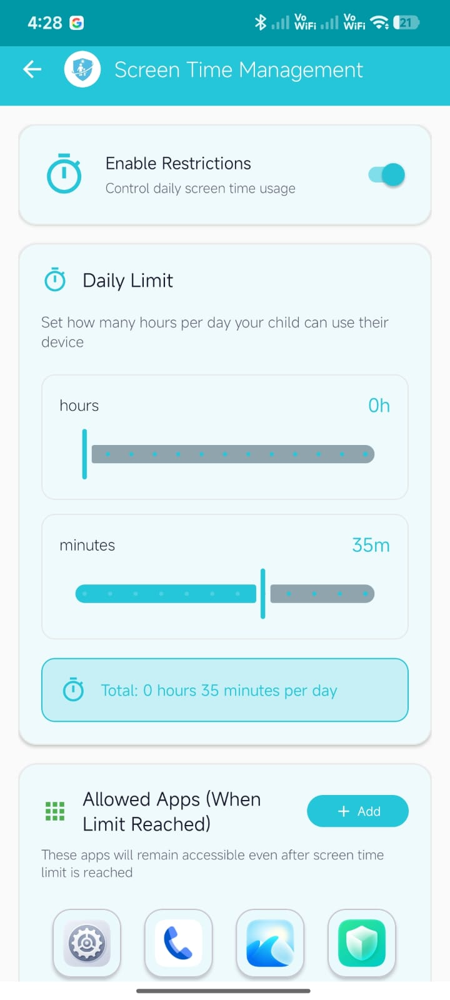
      <br/><b>5. Screen Time Caps</b>
    </td>
  </tr>
  <tr>
    <td align="center" width="20%">
      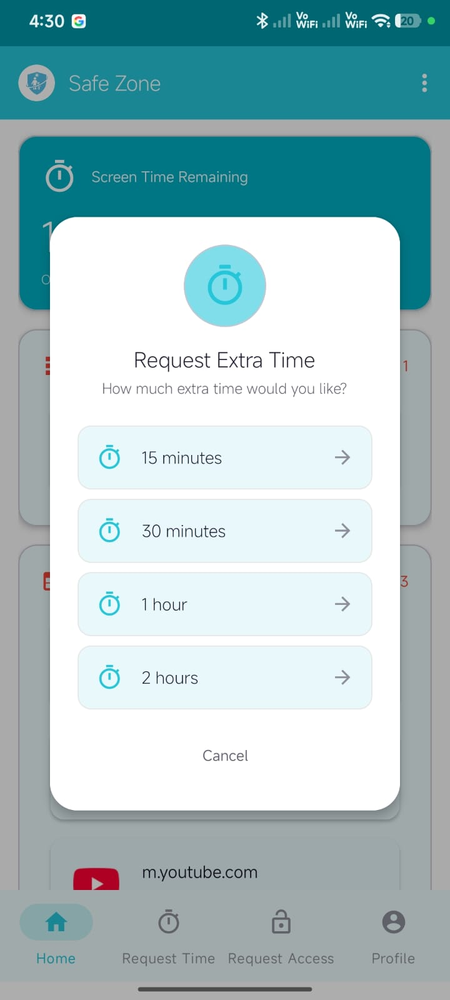
      <br/><b>6. Extra Time Request</b>
    </td>
    <td align="center" width="20%">
      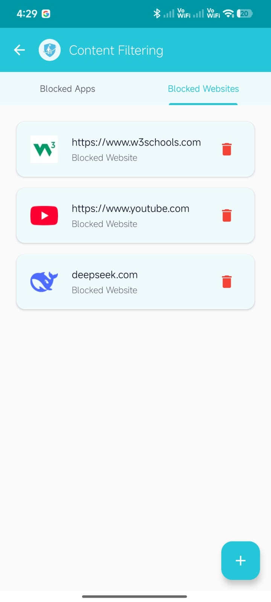
      <br/><b>7. Web Content Filter</b>
    </td>
    <td align="center" width="20%">
      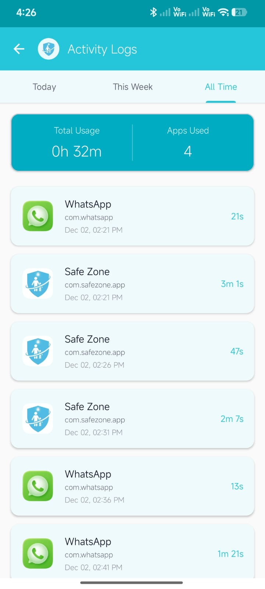
      <br/><b>8. Usage Analytics</b>
    </td>
    <td align="center" width="20%">
      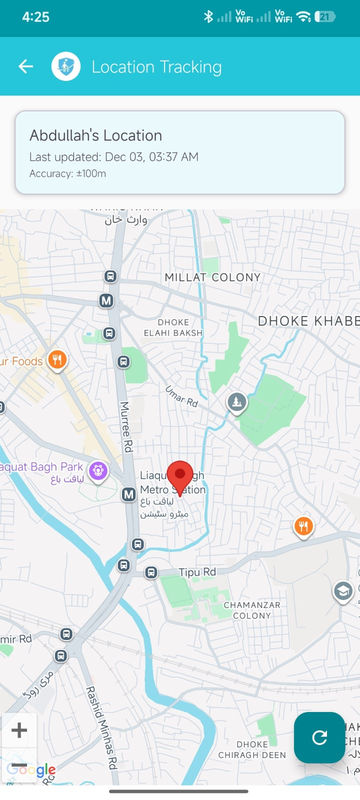
      <br/><b>9. GPS Geolocation</b>
    </td>
    <td align="center" width="20%">
      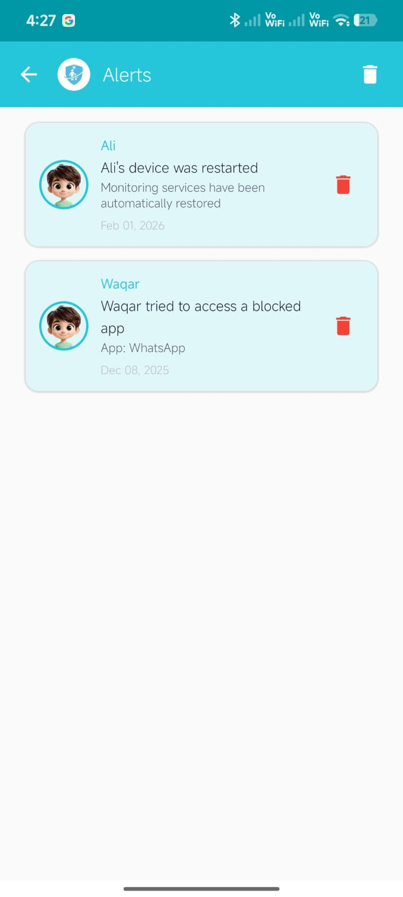
      <br/><b>10. Security Alerts</b>
    </td>
  </tr>
  <tr>
    <td align="center" width="20%">
      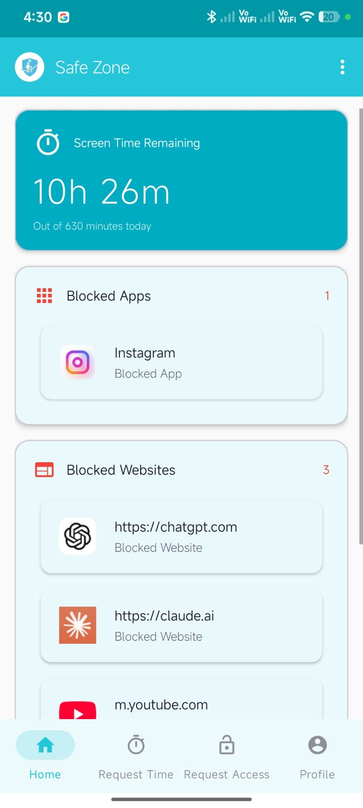
      <br/><b>11. Child Home Screen</b>
    </td>
    <td align="center" width="20%">
      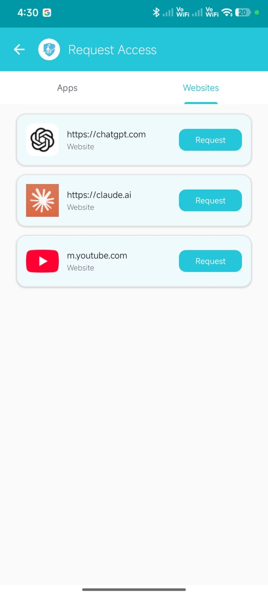
      <br/><b>12. Permission Request</b>
    </td>
    <td align="center" width="20%">
      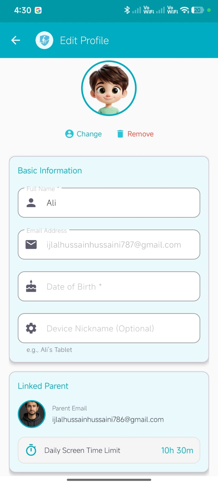
      <br/><b>13. Child Profile</b>
    </td>
    <td align="center" width="20%">
      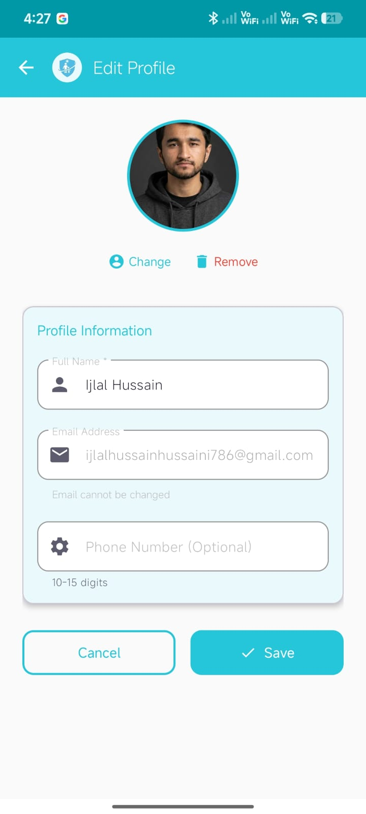
      <br/><b>14. Parent Profile</b>
    </td>
    <td align="center" width="20%">
      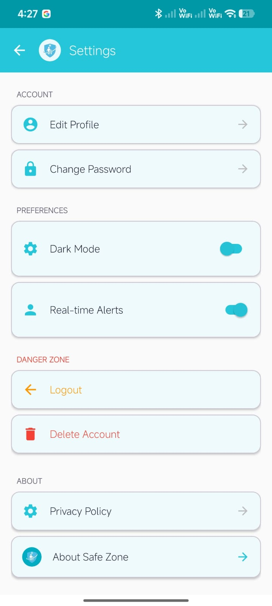
      <br/><b>15. Security Settings</b>
    </td>
  </tr>
</table>

---

## 🌟 Key Functional Highlights

### 👨‍👩‍👧‍👦 1. Parent Supervision Console
- **Real-Time Multi-Child Hub**: Manage and supervise multiple child accounts and linked devices from a single centralized dashboard.
- **Dual-Layer App Blocking**: Instantly restrict or block specific applications using a combination of Android `AccessibilityService` and `UsageStatsManager`.
- **Dynamic Web Filtering**: Real-time URL interception blocking adult content, malicious domains, and custom blacklists across Google Chrome, Brave, and default browsers.
- **Precision Screen Time Management**: Daily quota scheduler with custom weekday/weekend limits, sleep curfews, and emergency app whitelisting (Phone, Contacts, Emergency).
- **Live GPS Tracking & Geofencing**: Real-time location rendering on Google Maps SDK with customizable safe zones and geofence exit alerts.
- **Instant Push Security Alerts**: Automated alerts delivered upon curfew violations, restricted app launches, or geofence breaches.

### 👶 2. Child Companion & Protection Mode
- **Protected Kid Dashboard**: Intuitive interface displaying remaining daily screen time quota and permitted educational/entertainment apps.
- **Extra Time Request Loop**: Interactive dialog allowing children to politely request additional screen time, triggering real-time approval prompts on the parent device.
- **Emergency Safeguard**: Critical communication channels (Emergency SOS, Parent Dialer) remain permanently accessible even during active lock curfews.
- **Anti-Tamper Protections**: Background foreground services and device admin policies prevent unauthorized service killing or uninstallation.

---

## 🏗️ Technical Architecture & Core Stack

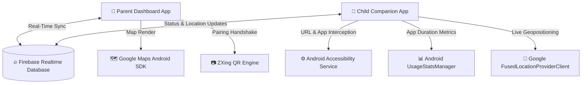

### 🛠️ Technology Specifications:
- **Programming Language**: Java (100% Native Android)
- **Minimum SDK Level**: Android 7.0 (API Level 24 - Nougat)
- **Target SDK Level**: Android 14 (API Level 34 - Upside Down Cake)
- **Backend & Cloud Services**: Firebase Realtime Database, Firebase Authentication, Firebase Cloud Storage
- **Mapping & Location**: Google Play Services Location API (`FusedLocationProviderClient`), Google Maps Android SDK
- **Pairing Engine**: ZXing Embedded (`com.journeyapps:zxing-android-embedded`)
- **UI & Layout Engine**: Android Material Design Components, ConstraintLayout, CardView, RecyclerView

---

## 🔒 Android System Permissions & Capabilities

SafeZone utilizes specialized Android system capabilities to ensure uninterrupted background protection:

| Permission | Purpose |
|:---|:---|
| `BIND_ACCESSIBILITY_SERVICE` | Real-time browser URL inspection and restricted app overlay blocking |
| `PACKAGE_USAGE_STATS` | Precise daily/weekly application launch count and duration telemetry |
| `ACCESS_FINE_LOCATION` & `ACCESS_BACKGROUND_LOCATION` | Accurate GPS coordinates for geofencing and live parent map tracking |
| `FOREGROUND_SERVICE` & `FOREGROUND_SERVICE_LOCATION` | Prevents Android OS from killing background monitoring worker processes |
| `SYSTEM_ALERT_WINDOW` | Displays immediate "Time Limit Reached" blocking overlays over restricted apps |
| `CAMERA` | QR code scanning during child device onboarding |

---

## 💻 Local Setup & Development Guide

To clone and compile SafeZone in Android Studio:

### 1. Prerequisites:
- **Android Studio Iguana / Jellyfish / Koala** or newer.
- **JDK 17** configured in Android Studio.
- An active **Firebase Project** with Realtime Database and Authentication enabled.
- A **Google Maps Android API Key**.

### 2. Clone & Open:
```bash
git clone https://github.com/Ijlal-Hussaini/Safe-Zone-Kid-Friendly-Internet-and-App-Monitoring.git
cd Safe-Zone-Kid-Friendly-Internet-and-App-Monitoring
```

### 3. Firebase Configuration:
1. Download your `google-services.json` from the Firebase Console.
2. Place `google-services.json` inside the `app/` root directory:
   ```
   Safe-Zone-Kid-Friendly-Internet-and-App-Monitoring/app/google-services.json
   ```

### 4. Google Maps API Key:
Add your Google Maps API key into `app/src/main/res/values/strings.xml` or `local.properties`:
```xml
<string name="google_maps_key">YOUR_GOOGLE_MAPS_API_KEY</string>
```

### 5. Build & Run:
- Select `app` configuration and hit **Run (Shift + F10)** on an emulator or physical device running Android 7.0+.

---

## 👨‍💻 Project Leadership & Attribution

- **Project Lead & Core Developer**: **[Ijlal Hussain](https://github.com/Ijlal-Hussaini)**
- **Academic Project**: Final Year Project (FYP) — **National University of Modern Languages (NUML), Islamabad**
- **Degree**: BS in Software Engineering (Graduated with **3.96 / 4.0 CGPA**)
- **Portfolio**: [https://ijlalhussain.vercel.app/](https://ijlalhussain.vercel.app/)
- **LinkedIn**: [https://linkedin.com/in/ijlal-hussain786](https://linkedin.com/in/ijlal-hussain786)
- **Email**: [ijlalhussain.eng@gmail.com](mailto:ijlalhussain.eng@gmail.com)

---

## 📄 License

This project is licensed under the **MIT License** — see the [LICENSE](LICENSE) file for full details.
